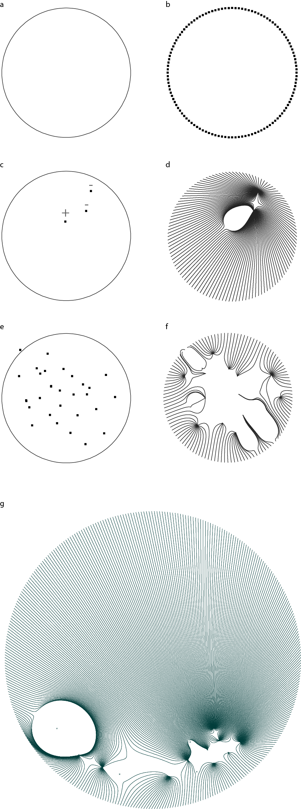

# deliberation-field
Deliberation Field

Deliberation field is a diagrammatic representation of information exchanges, such as dialogues, conflicts and discourses. It approaches the topic by representing multiple agents interacting with and in a vector fields. Each agent uses its position to influence the behavior of other agents and the construction of the fields of the environment.
It was developed as a 1-week project for the course Art and Machine Learning, 2018 Spring CMU

Implementation: 

Rhino
Grasshopper
GH Python

Techniques:

Vector fields are used to generate the curves to represent the influence of the agents in the environment. 

Agent-based navigation model inspired in the Reynold’s Boids (1986). It defines the moving actors in the field based on alignment, coherence and separation. Positive and negative charges indicate different ideological positions., which also affects their speed. 

Process:

A circle (a) defines the boundary of the field. This circle is divided in n points (b) that are used to define which curvesof the vector field are going to be visualized / integrated. Inside this field, points are generated along the time (c and e), representing different actors joining the deliberation.  This points have real numbers as their charges, which corresponds to a certain ideological position. As the time passes, more points join the deliberation field, changing the shape of the curves (d, f and g).

Results:

The resulting artwork is a generative animation displaying the change of the deliberation field along the time. It starts with two agents and at certain interval, one more agent join the field. The initial setup (velocity, location, and charge) is defined randomly. The behavior of the agents (cohesion, separation, alignment, and staying inside the circle) changes with the development of the field.   

Links:

https://youtu.be/C4Z3769O0ug
https://youtu.be/MVDnD6eucEU

Reflection:
Despite the interest in information exchange, the core of the work is visual and abstract. All the effort was done to reduce the artwork to the curves that represent the environment built in real time by the agents. These curves establish a visual composition that is ambiguous and can be associated with external references. As the lines converge, they become solid regions with high slope as in contour lines of mountains or in the geometric modeling of complex folding surfaces. Besides, the use of time enables the navigation of the agents and the development of a variety of complex “topographies”. I expect that with the visual stimuli and the title, the audience will be able to inquiry into the existence of the interacting agents that are embedded in the field composition.

References:
Reynolds, C. 1986. “Boids: Flocks.” Herds and Schools–a Distributed Behavorial Model.
